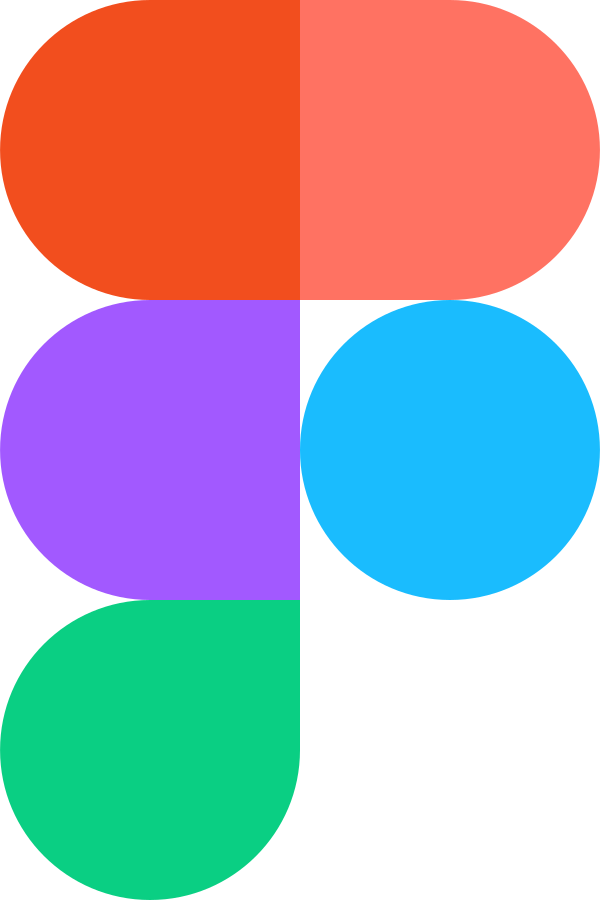

# About

- 🌕 Hi, I’m @visiongirles @duckate or Kate Sychenko
- 🌖 Started with iOS Mobile Dev - Swift
- 🌗 Current interest in Web Development and Software Development
- [Frontend] React · Redux Tool Kit · Sass · Bootstrap · Git · Figma
- [Backend] Node.js · Go · SQL
- 🌘 Some experience with C, Python
- 🌑 Attended Sber School 21 and Yandex Summer MobileDev School (2022)

 You can find me live at <a href="https://www.twitch.tv/duckate">twitch.tv/duckate</a> on weekdays
# Stack
         

# Showcase

## Full-stack
### Build Your Own Telegram like Messanger from scratch:
- Frontend https://github.com/visiongirles/Telegram TypeScript
- Backend https://github.com/visiongirles/TelegramServer JavaSript
- Local database - MySQL

## Backend
- Build Your Own Interpretator https://github.com/visiongirles/codecrafters-interpreter-go Go
- Build Your Own Redis https://github.com/visiongirles/Redis-server TypeScript
- Build Your Own HTTP server https://github.com/visiongirles/HTTP-Server JavaSript
- Build Your Own DNS server Go

## Frontend
https://github.com/visiongirles/TicTacToe
 - React
 - Redux Tool Kit
   
https://github.com/visiongirles/PiedPiper
https://github.com/visiongirles/UberEats
- Flexbox layout, Grid layout, Double container pattern, Float & clearfix, Link Anchors, EM & REM usage, Block, Element, Modifier Methodology
- Adaptive for Mobile & Desktop

https://github.com/visiongirles/BootstrapDemo
- Bootstrap, WebPack, Sass,  Autoprefixer, NodeJS, Docker

https://github.com/visiongirles/css-in-depth
- Overall functionallity practice

## Next task
https://nextjs.org/

# Personal library
## Current read
<pre>
https://app.codecrafters.io/courses/interpreter/overview
https://craftinginterpreters.com/
</pre>

## From-cover-to-cover
<pre>
<i>Grokking Algorithms</i>                   by A. Bhargava 🙏🐙Cthulhu bless the author
<i>Beej’s Guide to Network Programming</i>   by B. Hall
<i>CSS in Depth</i>                          by K. Grant
<i>SwiftUI Views Quick Start</i>             by M. Moeykens
<i>All</i>                                   by https://developer.apple.com/swift/
https://flexboxfroggy.com/#ru
https://react.dev/  
https://learn.javascript.ru/
https://www.freecodecamp.org/
https://redux.js.org/
https://jestjs.io/ 
</pre>

## Had a glance betweens the pages
<pre>
<i>Effective C</i>                           by R. Seacord
<i>Pointers in C</i>                         by N. Toppo and H. Dewan
<i>Modern C</i>                              by J. Gustedt
<i>C Programming Language</i>                by B. Kernighan and D. Ritchie
<i>Data Structures Using C</i>               by R. Thareja
<i>Programming iOS</i> series                by M. Neuburg
<i>Modern Full-Stack Development</i>         by F. Zammetti [Do not recommend this book]
<i>Clean Code</i>                            by R. Martin

</pre>
## Future read:
<pre>

</pre>
# Commits snake history

# Contact me
📧<a href="mailto:busy.sychenko@gmail.com">Email</a> &nbsp;&nbsp;&nbsp;&nbsp;&nbsp; 📱<a href="https://t.me/duckate">Telegram</a>
&nbsp;&nbsp;&nbsp;&nbsp;&nbsp; 👩‍💻<a href="https://leetcode.com/visiongirles/">Leetcode</a>&nbsp;&nbsp;&nbsp;&nbsp;&nbsp; 🧙‍♀️<a href="https://www.linkedin.com/in/kate-sychenko-50456a57/">LinkedIn</a>  &nbsp;&nbsp;&nbsp;&nbsp;&nbsp; ☕<a href="https://paypal.me/sychenko?country.x=AE&locale.x=en_US">Support</a> && <a href="https://www.donationalerts.com/r/duckate"> Support</a> &nbsp;&nbsp;&nbsp;&nbsp;&nbsp; 📺 <a href="https://www.twitch.tv/duckate">Watch</a> 
