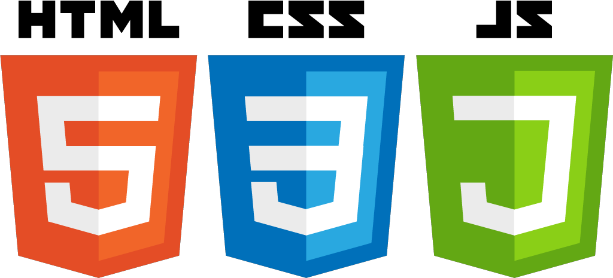

# Status
Sep 8, 2023 - welcome back to me. Let's try to get on track with Leetcode. One challenge a day. At least.

Sep 18, 2023 - random update. Keeping focus on studying. Got some day-offs, but in general doing more than one task in LeetCode per day. Tracking the learning highlights at <a href ="https://www.notion.so/JavaScript-Learning-Path-effd2b0e48bd4c3794390124098c217d">Notion</a>

# About

- 🌕 Hi, I’m @visiongirles @duckate or Kate Sychenko
- 🌖 Started with Mobile Dev: iOS and Swift
- 🌗 Currently learning Front-end
- 🌘 Also I’m a good friend to Python, C/C++
- 🌑 Attended Sber School 21 and Yandex Summer MobileDev School

# Stack
           

# Showcase
## Frontend
https://github.com/visiongirles/PiedPiper
https://github.com/visiongirles/UberEats
- Flexbox layout
- Grid layout
- Double container pattern
- Float & clearfix
- Link Anchors
- EM & REM usage
- Block, Element, Modifier Methodology
- Adaptive for Mobile & Desktop

https://github.com/visiongirles/BootstrapDemo
- Bootstrap
- WebPack
- Sass
- Autoprefixer
- NodeJS
- Docker

https://github.com/visiongirles/css-in-depth
- Overall functionallity practice

## Next task
https://angular.io/start
https://reactjs.org/

# Personal library
## Current read
<pre>
https://learn.javascript.ru/
https://www.freecodecamp.org/
<i>30 Days of React</i>                      by fullstack.io
<i>Deep work rules for focused success in a distracted world</i>
</pre>

## From-cover-to-cover
<pre>
<i>Grokking Algorithms</i>                   by A. Bhargava 🙏🐙Cthulhu bless the author
<i>Beej’s Guide to Network Programming</i>   by B. Hall
<i>CSS in Depth</i>                          by K. Grant
<i>SwiftUI Views Quick Start</i>             by M. Moeykens
<i>All</i>                                   by https://developer.apple.com/swift/
https://flexboxfroggy.com/#ru
</pre>

## Had a glance betweens the pages
<pre>
<i>Effective C</i>                           by R. Seacord
<i>Pointers in C</i>                         by N. Toppo and H. Dewan
<i>Modern C</i>                              by J. Gustedt
<i>C Programming Language</i>                by B. Kernighan and D. Ritchie
<i>Programming iOS</i> series                by M. Neuburg
<i>Data Structures Using C</i>               by R. Thareja
<i>Modern Full-Stack Development</i>         by F. Zammetti

</pre>
## Future read:
<pre>
http://smacss.com/ 
https://en.bem.info/methodology/
https://www.creativebloq.com/web-design/manage-large-css-projects-itcss-101517528
http://tallys.github.io/color-theory/
https://bespoyasov.ru/front-not-pain/#progress
<i>Clean Code</i>                            by R. Martin
<i>Web Performance in Action</i> (maybe?)    by J. Wagner 
</pre>
# Commits snake history

# Contact me
📧<a href="mailto:busy.sychenko@gmail.com">Email</a> me &nbsp;&nbsp;&nbsp;&nbsp;&nbsp; 📱<a href="https://t.me/duckate">Telegram</a> me
&nbsp;&nbsp;&nbsp;&nbsp;&nbsp; 👩‍💻<a href="https://leetcode.com/visiongirles/">Leetcode</a> & <a href="https://www.hackerrank.com/busy_sychenko">HackerRank</a>&nbsp;&nbsp;&nbsp;&nbsp;&nbsp; 🧙‍♀️<a href="https://www.linkedin.com/in/kate-sychenko-50456a57/">LinkedIn</a>  &nbsp;&nbsp;&nbsp;&nbsp;&nbsp; ☕<a href="https://www.buymeacoffee.com/duckate">Support</a> me 
